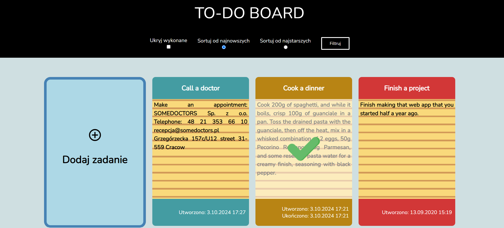
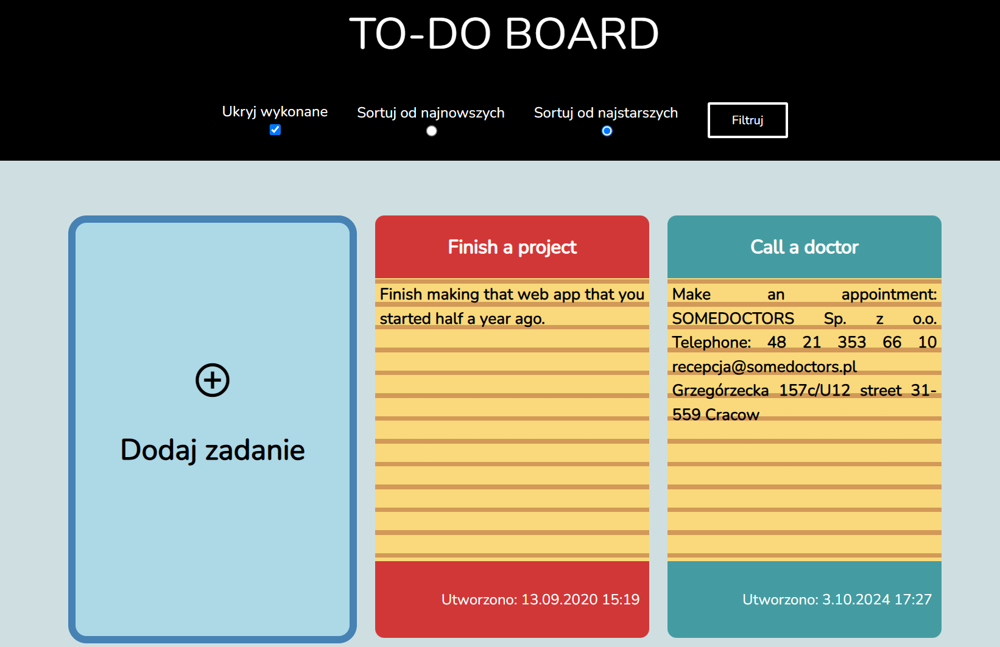
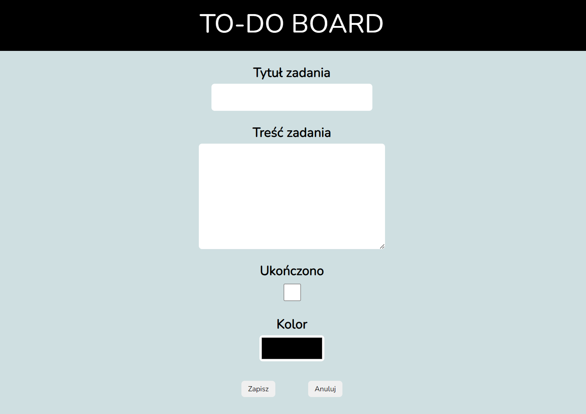
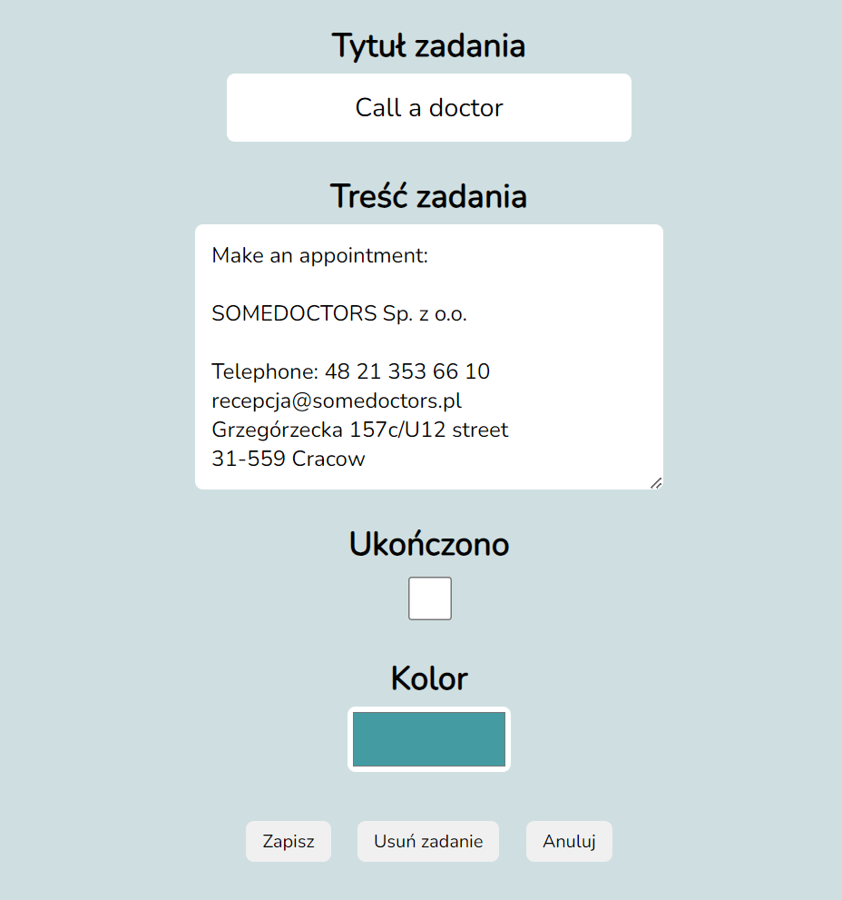

Web app made in <b>Node.js</b> that allows users to manage their daily tasks. Each task is stored in
<b>MySQL</b> database and is presented on the main page in a form of colorful notebooks.
 
User can set a name for a task, its description, and color displayed on a main page.
  
Technologies used in project: <i>Node.js, JavaScript, MySQL, Handlebars, HTML, CSS</i>

 

Aplikacja webowa utworzona w <b>Node.js</b> pozwalająca zarządać codziennymi zadaniami. Informacje o każdym zadaniu są
przechowywane w bazie danych <b>MySQL</b> i wyświetlane na stronie głównej w formie kolorowych notatników.
 
Dla każdego zadania można wybrać jego tytuł, opis oraz kolor w jakim wyświetla się na stronie głównej.
  
Technologie wykorzystame w projekcie: <i>Node.js, JavaScript, MySQL, Handlebars, HTML, CSS</i>

 

 

 

 

